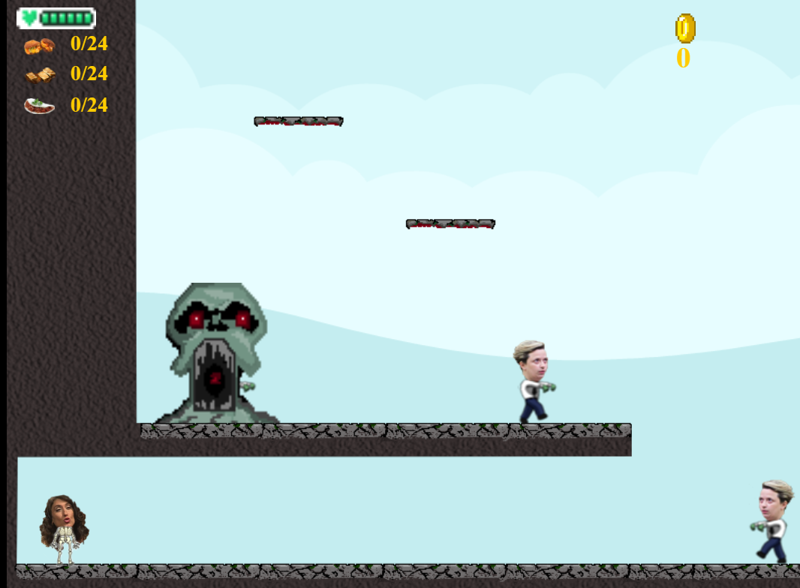

# Sobre mim

***

Nome? Iara. Sobrenome? Menezes. 19 anos, Brasileira, Pernambucana, atualmente reside em Natal/Rn. Ama Jesus. Ama pessoas. Ama música. _E especialmente as que ninguém conhece._ Apaixonada por Blues e por música folk. Arranha um violão e canta por hobby. Futura técnica em Programação de Jogos Digitais pelo Instituto Federal de Educação, Ciência e Tecnologia do Rio Grande do Norte, campus Ceará-Mirim/RN. _Somos a primeira turma do Brasil._ Atualmente, falta praticamente 25% para concluí-lo. _Estou em ânsias_. Futura Psicopedagoga. Um sonho? Desenvolver jogos para auxiliar no aprendizado de crianças autistas e com algum tipo de deficiência cognitiva. Amante da tecnologia, mas ainda mais amante pelos livros. Acredita em uma geração que compreende que diferenças não são defeitos, e por isso, promove sempre a empatia e o respeito. Filha do Amor, abomina calor, ama flor, e se fosse um dos 7 anões, com certeza seria o soneca. _Ela vive com sono._
_Vamos tomar um suco? O meu sem açúcar, por favor. Tou de dieta._ 🌺
 
  
                   _"Ser desenvolvedor é uma viagem onde a próxima parada é a solução de um problema."_
                       Thales Valentim 
                     

# Contatos

***

 Email :  iaram.menezes@yahoo.com.br

 Facebook : [Iara Menezes](https://www.facebook.com/iaramennezes)

 Instagram : [iaramennezes](https://www.instagram.com/iaramennezes)

 Blog : [Ouvindo o Céu](https://palavrasquecuramblog.wordpress.com/)

***

# Games

***

***

# Artes

***

# Projetos Desenvolvidos

***

# Trabalhos

**

# _Apresentações_

***

- # deixa em negrito
~~ Riscado
*** Adiciona uma linha horizontal
* Adiciona um ponto
1s numeros adicionam uma lista numerada
*s adiciona uma lista não numerada
 Link

 Isso para uma imagem com link

[O nome que vc quer que apareça](Link do site, ou link de algum arquivo que queira colocar) Isso é apenas para links sem imagem

